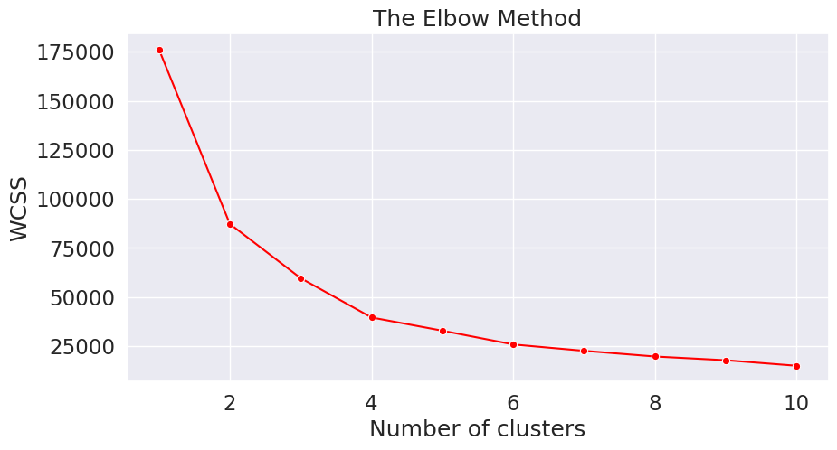
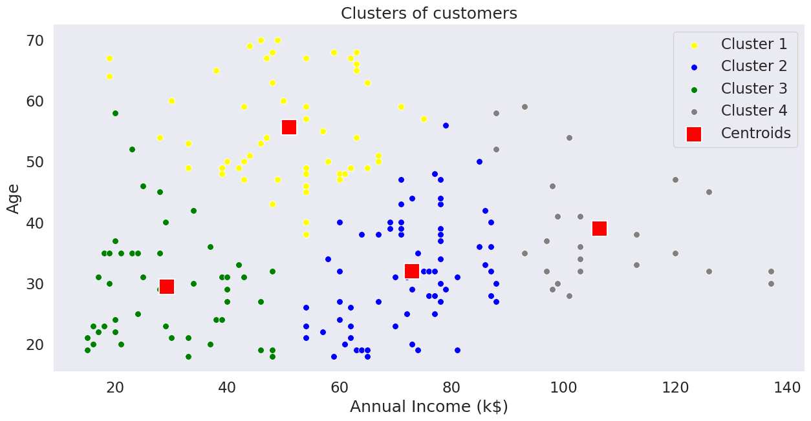

+++
draft = false
authors = ["John Rizzo"]
title = "k means clustering"
date = "2026-03-19"
tags = [
  "jupyter",
  "clustering"
]
categories = [
  "jupyter"
]
series = [
    "machine learning",
    "algorithms"
]
+++

# k-means clustering

This is my use of the k-means clustering algorithm against the Mall_Customers.csv dataset

* Reference: https://www.kaggle.com/code/shrutimechlearn/step-by-step-kmeans-explained-in-detail

Author: John Rizzo
Date: 02/01/2026

### Key Details

* Model Type: Clustering
* Applications: Customer Segmentation

https://scikit-learn.org/stable/modules/clustering.html#clustering

## Python/Notebook Setup


```python
#! pip install kagglehub sklearn numpy pandas matplotlib seaborn python-dotenv
```


```python
# Import necessary libraries
import os
import kagglehub
from kagglehub import KaggleDatasetAdapter
from sklearn.compose import ColumnTransformer
from sklearn.preprocessing import OneHotEncoder
from sklearn.model_selection import train_test_split
import numpy as np
import pandas as pd
import matplotlib.pyplot as plt
import seaborn as sns
sns.set(context="notebook", palette="Spectral", style = 'darkgrid', font_scale = 1.5, color_codes=True)
from dotenv import load_dotenv
load_dotenv()
```


    True


```python
RANDOM_STATE=42
```

## Loading/Cleaning Data


```python
if os.getenv('KAGGLE_API_TOKEN') is None:
    kagglehub.login()
```


```python
# Set the path to the file you'd like to load
file_path = "Mall_Customers.csv"

# Load the latest version
df = kagglehub.load_dataset(
    KaggleDatasetAdapter.PANDAS,
    "shrutimechlearn/customer-data",
    file_path,
    # https://github.com/Kaggle/kagglehub/blob/main/README.md#kaggledatasetadapterpandas
)
```

    Warning: Looks like you're using an outdated `kagglehub` version (installed: 0.3.13), please consider upgrading to the latest version (0.4.2).


    /tmp/ipykernel_1612330/2952537725.py:5: DeprecationWarning: Use dataset_load() instead of load_dataset(). load_dataset() will be removed in a future version.
      df = kagglehub.load_dataset(


```python
# Get a high level idea about the dataset
print(f"First 5 records:\n{df.head()}")
print(f"Dataset Info:\n{df.info}")
```

    First 5 records:
       CustomerID   Genre  Age  Annual_Income_(k$)  Spending_Score
    0           1    Male   19                  15              39
    1           2    Male   21                  15              81
    2           3  Female   20                  16               6
    3           4  Female   23                  16              77
    4           5  Female   31                  17              40
    Dataset Info:
    <bound method DataFrame.info of      CustomerID   Genre  Age  Annual_Income_(k$)  Spending_Score
    0             1    Male   19                  15              39
    1             2    Male   21                  15              81
    2             3  Female   20                  16               6
    3             4  Female   23                  16              77
    4             5  Female   31                  17              40
    ..          ...     ...  ...                 ...             ...
    195         196  Female   35                 120              79
    196         197  Female   45                 126              28
    197         198    Male   32                 126              74
    198         199    Male   32                 137              18
    199         200    Male   30                 137              83
    
    [200 rows x 5 columns]>


```python
# Check for missing data and replace as appropriate
df.isnull().sum()
```


    CustomerID            0
    Genre                 0
    Age                   0
    Annual_Income_(k$)    0
    Spending_Score        0
    dtype: int64


```python
# Drop duplicates if they exist
df.drop_duplicates(inplace=True)
```


```python
# Deal with categorical values

ohe = OneHotEncoder(sparse_output=False)
categorical_columns: list[str] = ['Genre']
ohe_array = ohe.fit_transform(df[categorical_columns])
ohe_df = pd.DataFrame(ohe_array, columns=ohe.get_feature_names_out(categorical_columns))
df= pd.concat([df.reset_index(drop=True), ohe_df], axis=1)
print(df.head())
```

       CustomerID   Genre  Age  Annual_Income_(k$)  Spending_Score  Genre_Female  \
    0           1    Male   19                  15              39           0.0   
    1           2    Male   21                  15              81           0.0   
    2           3  Female   20                  16               6           1.0   
    3           4  Female   23                  16              77           1.0   
    4           5  Female   31                  17              40           1.0   
    
       Genre_Male  
    0         1.0  
    1         1.0  
    2         0.0  
    3         0.0  
    4         0.0  


## Feature Engineering (N/A)

## Setup the features and target variables (X, y)


```python
# Splitup your testing/training data and target variables
X = df[['Genre_Female', 'Genre_Male', 'Age', 'Annual_Income_(k$)']]
y = df['Spending_Score']
X_train, X_test, y_train, y_test = train_test_split(X, y, test_size=0.2, random_state=RANDOM_STATE)
```

## Determine the number of clusters (using the elbow method)


```python
from sklearn.cluster import KMeans

wcss = []
for i in range(1, 11):
    kmeans = KMeans(n_clusters = i, init = 'k-means++', random_state=RANDOM_STATE)
    kmeans.fit(X)
    wcss.append(kmeans.inertia_)
```


```python
plt.figure(figsize=(10,5))
sns.lineplot(y=wcss, x=range(1, 11), marker='o', color='red')
plt.title('The Elbow Method')
plt.xlabel('Number of clusters')
plt.ylabel('WCSS')
plt.show()
```


    

    


## Final Fitting using value determined by elbow method


```python
kmeans = KMeans(n_clusters=4, init='k-means++', random_state=RANDOM_STATE)
predicted_values = kmeans.fit_predict(X)
```


```python
# Visualising the clusters
# Convert X to numpy array for proper indexing
X_array = X.values

plt.figure(figsize=(15,7))
sns.scatterplot(x=X_array[predicted_values == 0, 3], y=X_array[predicted_values == 0, 2], color='yellow', label='Cluster 1', s=50)
sns.scatterplot(x=X_array[predicted_values == 1, 3], y=X_array[predicted_values == 1, 2], color='blue', label='Cluster 2', s=50)
sns.scatterplot(x=X_array[predicted_values == 2, 3], y=X_array[predicted_values == 2, 2], color='green', label='Cluster 3', s=50)
sns.scatterplot(x=X_array[predicted_values == 3, 3], y=X_array[predicted_values == 3, 2], color='grey', label='Cluster 4', s=50)
# sns.scatterplot(x=X_array[predicted_values == 4, 3], y=X_array[predicted_values == 4, 2], color='orange', label='Cluster 5', s=50)
sns.scatterplot(x=kmeans.cluster_centers_[:, 3], y=kmeans.cluster_centers_[:, 2], color='red', label='Centroids', s=300, marker='s')
plt.grid(False)
plt.title('Clusters of customers')
plt.xlabel('Annual Income (k$)')
plt.ylabel('Age')
plt.legend()
plt.show()
```


    

    


```python

```
